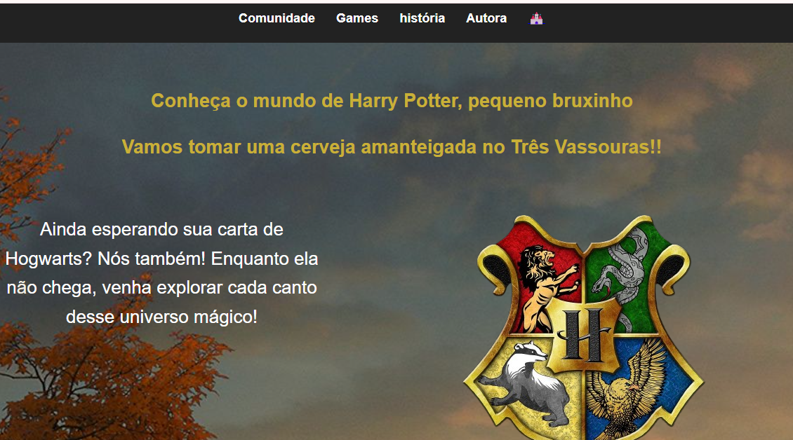
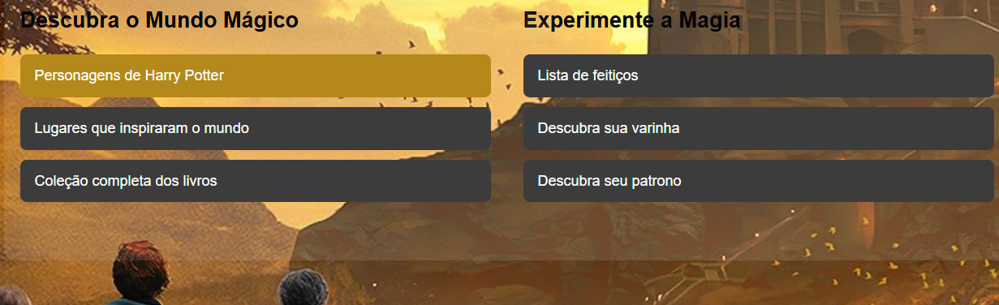
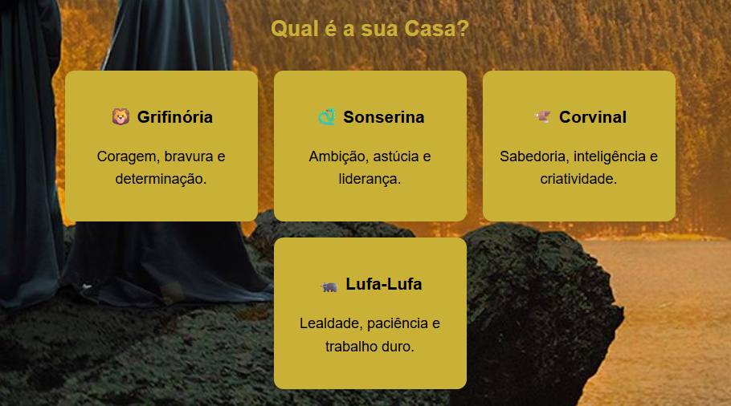

# 🧙‍♂️ Landing Page - Harry Potter

Uma landing page temática inspirada no universo de Harry Potter. Desenvolvida com HTML e CSS puro, com foco em layout responsivo, efeitos visuais e links interativos. Idealizada como parte de prática de front-end.

## 🌟 Recursos

- Animações de fundo com shapes flutuantes
- Seções temáticas sobre casas de Hogwarts, feitiços, personagens e mais
- Botões de CTA com links oficiais
- Design responsivo e visual imersivo

## 📸 Preview

## 🚀 Tecnologias

- HTML5
- CSS3

## 📚 Créditos

Inspirado no universo criado por J.K. Rowling.
